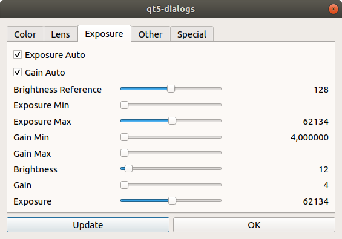

# QT5 Device Selection and Property Dialogs in C++
This sample contains a QT5 basic program and reusable dialogs for selecting devices and device properties. 
It can be used as start frame work or the source codes of the dialogs can be used in own C++ programs

The main window:


The device selection dialog:


The properties dialog:



The property dialog is build dynamically on the available device properties.

Programming language : C++

## Files:
Device Selection dialog:
+ cdeviceselectiondlg.cpp
+ cdeviceselectiondlg.h

Properties dialog:
+ cpropertiesdialog.cpp
+ cpropertiesdialog.h

Device class, wrapper for GStreamer code:
+ tcamcamera.cpp
+ tcamcamera.h

QT5 main window code
+ mainwindow.cpp
+ mainwindow.h
+ main.cpp

The cmake build description:
+ CMakeLists.txt


## Prerequisits
The sample uses  the *tiscamera* repository. *tiscamera* must have been build and installed.
Also QT5 for C++ must be installed

## Building
In order to build the sample, open a terminal, enter the sample's directory. Then enter
```
cd qt5-camera-dialogs
mkdir build
cd build 
cmake ..
make
./qt-dialogs
```


## Code Documentation

### Using the Device Selection Dialog
Include the file 

```C++
#include "cdeviceselectiondlg.h"
```
Add the file *cdeviceselectiondlg.cpp* to your make file.

Call the dialog as follows:
```C++
CDeviceSelectionDlg Dlg(window );
if( Dlg.exec() == 1 )
{
    OpenandStartDevice(Dlg.getSerialNumber(),
                Dlg.getWidth(),Dlg.getHeight(),
                Dlg.getFPSNominator(),Dlg.getFPSDeNominator());

}
```
The dialog has following functions, that are used to forward information about the selected camera to the TCamCamera object *_pCam*:

```C++ 
std::string getSerialNumber()
```
Returns the serial number of the selected camera.

```C++
int getWidth() 
```
Returns the width of the selected video format.
```C++
int getHeight()
```
Returns the height of the selected video format.
```C++
int getFPSNominator() 
```
Returns the numerator of the selected frame rate.
```C++
int getFPSDeNominator()
```
Returns the denominator of the selected frame rate.

Simple usage is:
```C++
_pCam = new gsttcam::TcamCamera(Dlg.getSerialNumber());

// Set video format, resolution and frame rate. We display color.
_pCam->set_capture_format("BGRx", 
                    gsttcam::FrameSize{Dlg.getWidth(),Dlg.getHeight()}, 
                    gsttcam::FrameRate{Dlg.getFPSNominator(),Dlg.getFPSDeNominator()});
// Show the live vieo
_pCam->start();
```
The *OpenandStartDevice()* does some more things, e.g. setting the *ximagesink* as display and assigns the window ID of the video display widget to the sink, so the live video is shown nicely on the program window.


### Using the Properties Dialog
Include the file 
```C++
#include "cpropertiesdialog.h"
```
Add the file *cpropertiesdialog.cpp* to your make file.

Call the dialog as follows:
```C++
if( _pCam != NULL )
{
    CPropertiesDialog Properties(nullptr);
    TcamProp* ptcam = (TcamProp*)_pCam->getTcamBin();
    // Pass the tcambin element to the properties dialog
    // so in knows, which device do handle
    Properties.SetCamera(ptcam);
    Properties.exec();
}
```
The *CPropertiesDialog* receives the *Tcamprop* object directly, so the dialog can be used without the TcamCamera class too.

### CMakeLists.txt
The *CMakeLists.txt* contains commands for QT5
```
set(CMAKE_AUTOMOC ON)
set(CMAKE_AUTORCC ON)
set(CMAKE_AUTOUIC ON)
```
They are necessary for the build tools building the MOC files.

QT Creator or similar is not necessary.
