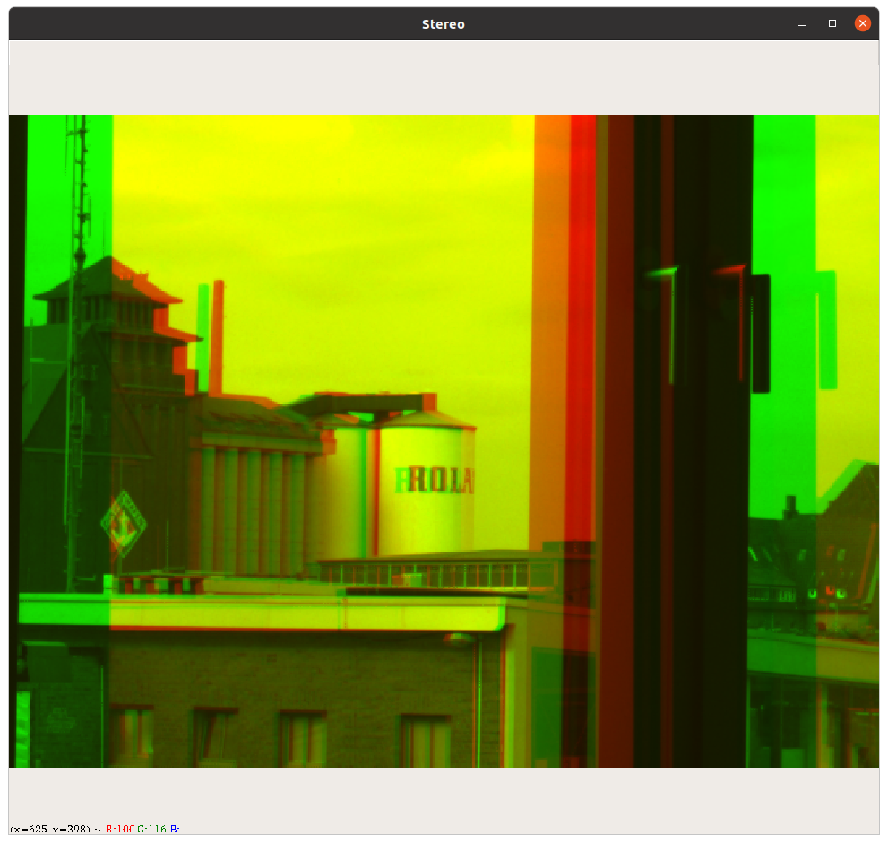

# Stereo
This Python sample shows
* how to configure two cameras
* trigger the cameras by software for image pairs
* use a callback for image saving in memory
* merge the mono images into an RGB image for anaglyph stereo 3D display
* use of softwaretrigger
* use of partial scan properties in order to move an ROI on the sensor.

Requirements:
* two identical The Imaging Source cameras
* two identical lenses
* Anaglyph (red/green) glasses or a red and a green foil
* tiscamera gstreamer modules
* Python JSON
* Python OpenCV

**Attention:**
If you got the sample working, you may get sick looking at the 3D image.

A sample image:


The sample is based on the Pyhton Multicamera samples. Therefore, there is a `cameras.json` file for camera configuration:
```JSON
{
    "cameras":[
        {
            "serial": "04619901",
			"format" : "video/x-raw",
			"pixelformat" : "GRAY8",
			"width" : 640,
			"height" : 480,
            "framerate":"15/1",
            "trigger":
                {
                    "property":"Trigger Mode",
                    "on" : true,
                    "off" : false
                }
            ,
            "properties":
            [
                {"property":"Offset Auto Center",  "value":false},
                {"property":"Offset X",  "value":890},
                {"property":"Offset Y",  "value":680}

            ],
            "imageprefix" : "right"            
        },        
        {
            "serial": "14710502",
			"format" : "video/x-raw",
			"pixelformat" : "GRAY8",
			"width" : 640,
			"height" : 480,
            "framerate":"15/1",
            "trigger":
                {
                    "property":"Trigger Mode",
                    "on" : true,
                    "off" : false
                },
            "properties":
            [
                {"property":"Offset Auto Center",  "value":false},
                {"property":"Offset X",  "value":918},
                {"property":"Offset Y",  "value":703}
            ],
            "imageprefix" : "left"            
        }
    ]
}
```
This sample configures two USB v4l2 cameras. A 640 x 480 resolution is used, each camera runs with 15 frames ber second. The output format of `tcambin` is GRAY8. The images of both cameras will be merged into an RGB image using OpenCV.

Since the cameras have no identical optical axis and they may be are not aligned exactly, the Python script uses the camera's partial scan offset properties for moving the ROI on the sensor. The `cameras.json` contains the initial values. Very important: the `Offset Auto Center` must be disabled first, otherwise the X and Y offsets can not be set.

The `cameras.json` also contains some initial values for the offset X and Y.

The 'imageprefix` is used in order to identify the left and right camera. Left will be red, the right will be green in the resulting image.

The trigger mode property is set to use with v4l2 cameras:
```JSON
            "trigger":
                {
                    "property":"Trigger Mode",
                    "on" : true,
                    "off" : false
                }
```
In case a GigE camera is used, it must be changed to 
```JSON
            "trigger":
                {
                    "property":"Trigger Mode",
                    "on" : "On",
                    "off" : "Off"
                }
```
(At least, the script can use both cameras at the same time, e.g. left is DFK 33UX250, right is DFK 33GX250. For each camera the trigger mode parameters are defined individually.)

## The Python Code
The source code is mostly similar to the Python Multicamera Trigger sample. The `CAMERA` class is moved into an own file `CAMERA.py`. This reduces the code in the `stereo.py` to the relevant part.

A custom data class was added, which will receive the images in the callback:
```Python
class CustomData:
        ''' Example class for user data passed to the on new image callback function
        '''
        def __init__(self):
                self.imageleft = None
                self.imageright = None
                self.dummy = None
```
It contains three images. `dummy` is needed for the `cv2.merge` function and is created in the callback with zeros.

The CustomData class is initialized by
```Python
CD = CustomData()
```
It is passed to the callback:
```Python
    camera.set_image_callback(on_new_image, CD)                                
```
(I must admit, I am not sure, whether this is really thread safe. Corrections are welcome!)

The callback looks as follows:
```Python
def on_new_image(camera, userdata):
    if camera.imageprefix == "left":
        userdata.imageleft = camera.Get_image()
    else:
        userdata.imageright = camera.Get_image()

```
Only the images are assigned to the user data. 

The main loop sends the software trigger to both cameras:

```Python
        for camera in cameras:
            camera.set_property("Software Trigger",1)
```
Then in a loop the script waits for both images:
```Python
        tries = 10
        while CD.imageleft is None and CD.imageright is None and tries > 0:
                time.sleep(0.1)
                tries -= 1
```
It is tried for one second. The real check for both images is done afterwards:
```Python
        if CD.imageleft is not None and CD.imageright is not None:
            error = 0
            createAnaglyphimage(CD)
        else:
            error += 1
```
If both images arrived, then the anaglyph image is created. The cameras are in trigger mode, therefore the callback is not called, while we are in the image processing. 

```Python
def createAnaglyphimage( images ):
    if images.dummy is None:
        if images.imageleft is None:
            size = images.imageright.shape[0], images.imageright.shape[1], 1
        else:
            size = images.imageleft.shape[0], images.imageleft.shape[1], 1
        images.dummy = np.zeros(size, dtype=np.uint8)
       
    anaglyph = cv2.merge((images.dummy, images.imageright, images.imageleft) )    
    cv2.imshow('Stereo', anaglyph)
```
First it is checked, whether the dummy image, which will be a numpy object, must be created. Then `cv2.merge()` is used to create the anaglyph image, which is shown in an OpenCV window.

# Align the cameras
In order to recieve a good stereo 3D effect, the images of both cameras must be aligned. That means, the objects in the scene must be on the same line or height in the left and right camera image. This is aligned by setting the `Offset Y` property. It can be done interactively by pressing the "w" and "s" key:

```Python
        if lastkey == 119:            
            y -= 2
            cameras[0].set_property("Offset Y",y)
            print("y  {} x1 {}  x2 {}".format( y, x1 ,x2 ) )

        if lastkey == 115:
            y += 2
            cameras[0].set_property("Offset Y",y)
            print("y  {} x1 {}  x2 {}".format( y, x1 ,x2 ) )
```
Only the ROI of first camera is moved.

The 3D effect is better to see, if the objects in the scene are also on nearly the same image position horizontaly. Therefore, the ROIs of both cameras can be moved with "a" and "d".

"a" moves the ROI of the left camera to the left and of the right camera to the right. "s" is vice versa. It is done by
```Python
        if lastkey == 97:
            x1 -= 2
            cameras[0].set_property("Offset X",x1)
            x2 += 2
            cameras[1].Set_Property("Offset X",x2)
            print("y  {} x1 {}  x2 {}".format( y, x1 ,x2 ) )

        if lastkey == 100:
            x1 += 2
            cameras[0].set_property("Offset X",x1)
            x2 -= 2
            cameras[1].set_property("Offset X",x2)
            print("y  {} x1 {}  x2 {}".format( y, x1 ,x2 ) )
```
The initial values of `y`, `x1`and `x2` are queried after the cameras have been started the main loop starts:
```Python
y = cameras[0].set_property("Offset Y").value
x1= cameras[0].set_property("Offset X").value
x2= cameras[1].set_property("Offset X").value
```

# Getting started:
## Step 1
* Setup cameras, mount lenses, set focus and iris
* Enter the serial numbers of right and left camera in the `cameras.json`.`imageprefix` identifies the left and right camera.

## Step 2
* start the script, wait for the anaglyph image
* align the heights of the scene to the same in red and green by pressing "w" or "s"
* if red and green distance looks too big, press "d" or "a" to move horizonally

## Step 3
* wear your red green glasses now
* press "a" and "d" until you get a nice 3D effect

# Changing to red blue colors
The line
```Python
anaglyph = cv2.merge((images.dummy, images.imageright, images.imageleft) )    
```
generates the red green image. If a red blue goggle is availble, then the line must be
```Python
anaglyph = cv2.merge((images.imageleft, images.imageright, images.dummy ) )    
```

# Warning
Again I would like to point out:
* wearing red/green or red/blue glasses can lead to head aches 
* wearing red/green or red/blue glasses may let you see these colors for a time span, even if you do not wear the glasses anymore. 
* the program can lead to sickness.
 


